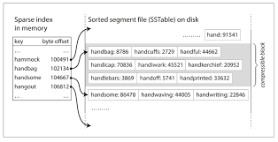

Hash Indexes:

- Index stored in memory as a hash map containing keys and offsets to file position.
- This is very simple, but is actually used by Bitcask (the default storage engine for Riak) a no-sql key-value store
- This is well suited to a situations where each key is updated frequently, for example lets say products and stock in a shop. 
Where keys would be the products and stock the value. We have lots of writes (people buying things, restocking), but not too many distict keys.
You have a lot of writes per key, but you could feasibly keep the keys in memory

Compaction:
- As I've said we only ever append to a file, so how do we avoid filling up the disk? 
- A good solution to this is splitting up the log file into segments. 
- When the segment file reaches a certain size we close the file and start writing to a new file. 
- This allows for compaction of older segments. This entails throwing away duplicate keys in the segments. As 
we are only appening to files the latest record for a given key is the current record for the file so any older records can be thrown away 
- In these update heavy scenarios after compaction the segments should have significantly reduced in size and it is possible to merge multiple segments together. 
- Segments are never modified after they have been written so the compaction process writes to a new segment file.
- As such the compaction process can be run in a background thread so we can maintain the dbs availability and read from the old segment files during this process. Then once complete we switch over to the new segment files. Then the old segment files can be deleted.
- Each segment now has it's own in memory hash table and when searching for a value for a given key we search each hash map starting rom the newest to the oldest. 
- To delete a record a special tombstone record iis appended that will get cleaned up in the compaction process
- If our process/machine crashes we will lose our in memory hash maps. These can be recreated directly from the segment files, however this can take some time if the segment files are large. So some dbs will speed up recovery by storing a snapshot of the segments hashmap on disk for quicker recovery.

Append log:
Append only logs can seem wasteful at first glance,why don't we just update the file in place overwriting old values? However they provide some benefits:

- Appending and segment merging are sequential write operations which are generally much faster than random writes.

- Concurrency and crash recovery are much simpler if isegment files are append only, or immutable. You don't have to worry about the case where a crash happend while a value was being overwritten. 

- Merging old segments avoids the problem of data files getting fragmented over time.

Downsides:
- In order for this db to work we need to be able to keep the hashmaps in memory. If we have a very large number of keys this can become infeasible. In principle you could keep the hashmaps on disk, but it is difficult to make on disk hash tables perform efficiently. They require a lot of random access I/O, hash collisions are difficult to manage and they can be expensive to grow when full. 

- Range queries are not efficient as you have to look up key individually in the hash maps. 

How can we solve these downsides? 

In the hash indexing example we just write to file with every new request. We can make a simple change to the way we store our data. 

If instead we assert that our segment files must be sorted by key. We call this format a sorted string table, or SStable for short. In this format we cannot append new key-value pers to the segment files immediately as they can come in any order. We will see shortly how we overcome this. 

SStables have some big advantages over log segments with hash indexes. 

- Merging SSTables is simple and efficient, even if our segments are bigger than the available memory. We essentially use a mergesort algorithm illustrated below
    - if key appears in multiple segments take the latest segment as segments are written sequentially.

- In order to find a particular key in the file we no longer need to keep an index of all keys in memory. Say you are looking for a specific key, then as long as you know some bounding keys you can search in between as the log is ordered by key. 

- You still need an in memory index to tell you the offsets of some keys, but this can be very sparse: one key for every few kilobytes of segment file is sufficient.

- We can even compress the block of memory in between our sparse keys as we will always have to scan the whole block. 

Constructing and maintaining SSTables:

This is all well and good , but how do we get our data sorted by key in the first place? As writes can come in in any order. 

We will maintain an inmemory soreted data structure. There are lots of well known tree data structures that you can use such as red-black, or AVL trees. 

We can now make our storage engine function like this: 
- When a write comes in add it to the in memory balanced tree structure. We will call this structure a memtable. 
- When the memtable reaches a certain size (typically a fef MB) we write out to disk. This is efficient as the tree already maintains a sorted order. While we are writing to disk a new memtable is created and any writes will get stored in the new memtable
- In order to perform a read. First check the in memory memtable then if it is not stored in there look at each segment on disk from newest to oldest. 
- From time to perform merging and compaction to combine segment files and discard deleted or overwritten values.

- One problem that this storage scheme uffers from is if the db crashes we lose the latest memtable. This can be mitigated by implementing a write ahead log. I.e. every time a new key comes in we first append to a seperate log which is unordered then write to the memtable. It doesn't matter that this log is unordered as it's only purpose is to restore the memtable in the event of a db crash. Delete the corresponding log every time we write a memtable to a segment file. 

This scheme is called an LSM tree and is used by many different dbs namely LevelDB, RocksDB, Cassandra and HBase. 

Optimisations:
- One thing you may notice is that if we attempt to read from the db, but the record does not exist in any of the segments we have to check the memtable and then all the segments back to the oldest segment before we can be sure that a key does not exist in the db. A solution to this problem is to use a data structure called a bloom filter. This is similar to a hash table, but does not store the actual values in the rather it will store whether the key is in the set or not. Bloom filters assure no false negatives and can be tweaked to have a very low false posutive rate. Looking at the bloom filter will tel us whether the key is in the db or not thus saving unecessary disk reads. 

- Talk about compaction and levelled/size-tiered.

