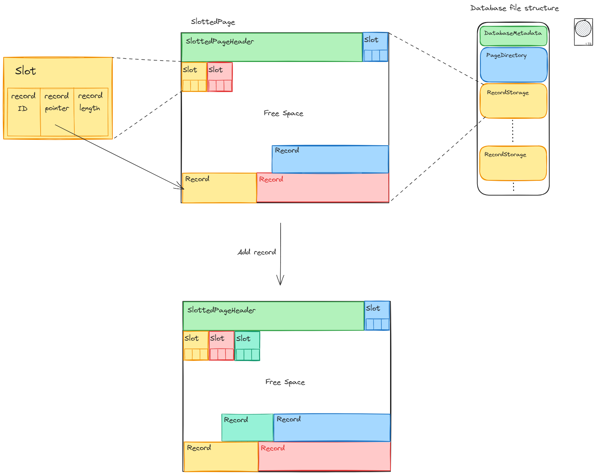

# Slotted Page Database Architecture

This document outlines the conceptual architecture of our slotted page-based database. The diagram above provides a visual representation of the key components and their relationships.  This architecture is designed to provide efficient on-disk storage and support concurrent access to data records within a database file.

We employ three primary structural components to manage our database:

## 1. Database Metadata

The **Database Metadata** component represents the top-level structure that holds overarching information about the entire database system.  It acts as the entry point and configuration store for the database file.

**Responsibilities:**

*   **System-wide Configuration:** Stores critical metadata applicable to the entire database instance.
*   **File Location:**  Tracks the physical location of the database file on disk.
*   **Database Versioning:**  Records the version of the database software or schema in use.
*   **Page Directory Location:**  Points to the starting location of the `PageDirectory` within the database file.
*   **Slotted Page Size:** Defines the fixed size of all `SlottedPage` units within this database. This is a fundamental parameter affecting storage capacity and performance.

## 2. Page Directory

The **Page Directory** is responsible for maintaining an index of all `SlottedPage` instances within the database file. It serves as a lookup mechanism to quickly locate any slotted page given its unique Page ID.

**Responsibilities:**

*   **Page Index:**  Keeps a directory or catalog of all slotted pages currently in use within the database.
*   **Page Location Pointers:** For each slotted page, it stores a pointer (offset) to the starting byte location of that page within the database file.
*   **Page IDs:** Assigns and manages unique Page IDs for each `SlottedPage`, enabling efficient retrieval and referencing.
*   **Fixed Size (Current Implementation):** In the current implementation, the Page Directory is allocated a fixed size within the database file at initialization. A significant amount of free space is reserved to accommodate the addition of new page pointers as the database grows.
*   **Future Enhancement:**  For increased scalability and to overcome the fixed-size limitation, a potential future improvement is to implement the `PageDirectory` itself as a `SlottedPage`. This would allow the Page Directory to grow dynamically as needed, just like the data storage pages.

## 3. Slotted Page

The **Slotted Page** is the fundamental unit of on-disk storage for records in our database.  It is a fixed-size block of bytes within the database file, designed to efficiently store and manage multiple records within a single page.

**Key Features and Components:**

*   **Fixed Size:** Each `SlottedPage` has a predetermined, fixed size (e.g., 4096 bytes). This fixed size simplifies storage management and I/O operations.
*   **SlottedPageHeader:**  Located at the beginning of each `SlottedPage`, the header contains metadata *about* the page itself and manages the **Slot Directory**.
    *   **Page Metadata:**  Includes essential information such as:
        *   `Page ID`: A unique identifier for this specific slotted page.
        *   `Free Space Start`: Pointer indicating the starting byte offset of the free space area within the page. The header grows *forwards* from the beginning of the page towards this pointer.
        *   `Free Space End`: Pointer indicating the ending byte offset of the free space area. Records are added in the free space and grow *backwards* from this pointer towards the `Free Space Start`.
        *   `Next Row ID`:  A counter to ensure unique IDs are assigned to new records added to this page.
    *   **Slot Directory:** An array of `Slot` entries, also located within the `SlottedPageHeader`.  The directory grows forward within the header, reducing the `Free Space Start`.  Each `Slot` in the directory corresponds to a record stored on the page.
*   **Slot:** Each `Slot` is a small, fixed-size structure within the `SlottedPageHeader`'s Slot Directory. It contains:
    *   `Record ID`:  A unique identifier for the record within the page (and potentially within the database in conjunction with the Page ID).
    *   `Record Pointer (Offset)`:  The starting byte offset within the `SlottedPage` where the actual record data is stored.  This points into the Record Storage area.
    *   `Record Length`: The size in bytes of the record data.
*   **Record Storage Area (Data Area):** The remaining space within the `SlottedPage` (after the header and slot directory) is used to store the actual record data. Records are added contiguously starting from the end of the page and growing backwards towards the header, effectively using the "Free Space".
*   **Free Space Management:**  The `SlottedPage` efficiently manages the available space by using the `Free Space Start` and `Free Space End` pointers.  As new slots and records are added, these pointers move towards each other, reducing the contiguous free space.

**How Adding a Record Works (Conceptual Flow):**

When a new record is added to a `SlottedPage`:

1.  **Space Check:** The `SlottedPage` checks if there is enough `Free Space` available to accommodate the new record data and a new `Slot` entry in the header.
2.  **Page Full Exception:** If insufficient space exists, a `PageFullException` is raised, indicating the record cannot be added to this page.
3.  **Slot Creation:** If sufficient space is available, a new `Slot` entry is created in the `SlottedPageHeader`'s Slot Directory. This slot is assigned the `Next Row ID`, a `Record Pointer` to the current `Free Space End` minus the `Record Length`, and the `Record Length` itself.  The `Next Row ID` is then incremented.
4.  **Record Data Write:** The actual `record` data (bytes) is written to the `Record Storage Area` of the `SlottedPage`, starting at the calculated `Record Pointer` and extending backwards.
5.  **Free Space Update:** The `Free Space Start` pointer in the `SlottedPageHeader` is moved forward (increased) by the `SLOT_SIZE` (size of the new slot). The `Free Space End` pointer is moved backward (decreased) by the `Record Length`.
6.  **Header Update:** The `SlottedPageHeader` (including the updated slot directory and free space pointers) is serialized back into bytes and written to the beginning of the `SlottedPage`'s byte array, updating the on-disk representation of the header.
7.  **Dirty Flag:** The `is_dirty` flag on the `SlottedPageHeader` is set to `True`, indicating that the page has been modified and needs to be written back to disk.

**Benefits of Slotted Page Architecture:**

*   **Efficient Space Utilization:**  Slotted pages allow for efficient storage of variable-length records within fixed-size pages. Free space within a page is utilized dynamically.
*   **Defragmentation (within a Page):**  While page-level defragmentation is not explicitly addressed here, the slotted page structure itself helps prevent fragmentation *within* a page. Records can be added and potentially marked as deleted (in future implementations), and new records can reuse space from deleted records within the same page, improving space reuse at the page level.
*   **Potential for Concurrency:**  Slotted pages can be designed to support concurrent access by multiple users or processes, especially when combined with appropriate locking or concurrency control mechanisms at the page level (though concurrency aspects are not detailed in this conceptual overview and would be part of further design considerations).
*   **Simplified Record Management:** Slots provide a directory-like structure to easily locate, update, and delete records within a page using record IDs and pointers.

**Conclusion:**

This slotted page architecture provides a foundational structure for building a robust and efficient on-disk database storage system. By combining a database-level metadata structure, a page directory for page management, and the slotted page design for record organization within pages, we establish a flexible and scalable approach to data storage and retrieval. Future development can build upon this core architecture to implement features such as indexing, transaction management, and more advanced concurrency control.
